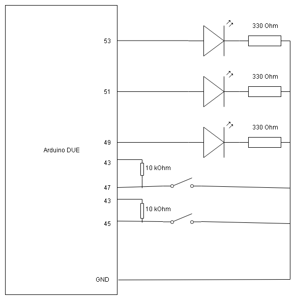
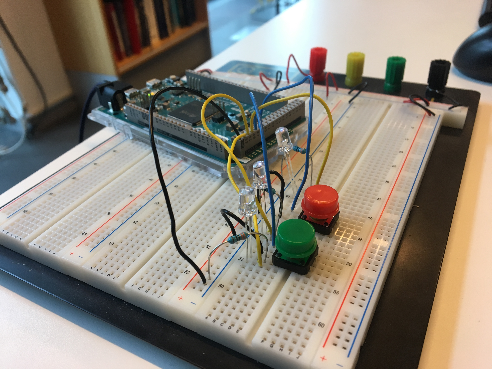

# Förberedelse inför laboration 1803g

*Philip Ekholm, 2018-10-01*

Under laboration 1803g kommer ni att bygga ett reaktionstestspel. Som en förberedelse inför denna laboration kommer ni att sätta upp fungerande knappar samt lysdioder som en form av indikator.

Komponenter för att koppla upp detta har getts ut. Om ni fortfarande inte har erhållit sådana komponenter kontakta labansvarig. Observera att denna förberedelse måste vara färdig innan laborationstillfälle för möjlighet att bli klar med laborationen samma dag.

## Uppkoppling av reaktionstest

Ni behöver inte använda er av de pinnar som finns specificerade här, notera dock att andra pinnar kan behövas under senare delen av laborationen samt att dessa är försatt i testprogrammet. Ändra på egen risk.

**Eventuellt behövs inte resistorerna till knapparna utan kan tas bort helt och hållet. Om ni får problem med knapparna under laborationen testa att ta bort dessa.**

Att ha 330 Ohm på motstånden till lysdioderna kan anses att ta i med tanke på att pinnarna levererar endast 3,3 V, så om ni kan hitta mindre bör det fungera väl att använda sig av det.

Ett exempel på hur det skulle kunna se ut

Bonuspoäng för den som lyckas dra med extremt korta kablar!

## Testprogrammet

Till det här repot finns ett projekt vid namn TestSetup. Med hjälp av denna ska ni snabbt kunna testa och se ifall ni har kopplat upp allt korrekt. 

Främsta delen av koden finns i main.c varav koden i sig bör vara ganska självförklarande. Utöver main.c finns drivrutin för att skriva till terminalen samt en översättningstabell (pin_mapper.c) mellan Arduino-due pinnumrering samt SAM-numrering. 

Inuti main.c används ioport för att konfigurera pinnar. Notera också koden för att sätta igång pull-up på pinnarna kopplade till knapparna. Så länge pinnarna inte är jordade kommer pinnarna att ligga på en etta (3,3V).

Utöver pull-up så finns det även funktionalitet för anti-knappstuds filter som är direkt inbyggt i Arduino-due kortet. Om ni har problem med knappstuds på era knappar rekommenderar jag att testa ändra lite grann på värdena som finns i koden.

För själva testet i sig så trycker du på en viss knapp. Om knappen fungerar som tänkt ska en lysdiod tändas. Om du trycker på den andra knappen ska en annan lysdiod tändas. Om du trycker på båda knapparna samtidigt kommer alla tre lysdioder att tändas. Utöver detta kommer även det förväntade resultatet att skrivas ut i terminalen. Om knapparna följer ovanstående specifikation så grattis, hårdvaran är nu uppkopplad och klar!

Använd gärna koden som finns i testprogrammet för själva laborationen i sig. Var säkra också inför del 2 av laborationen att ni använder er av 1803b projektet som grund för erat nya projekt.

